# Proyecto: Gestión de BD con Python y MySQL

**Módulo:** Administración de Sistemas Informáticos en Red / Programación  
**Autores:** Edwin Javier Cueva Berenguer y Javier Sánchez López  
**Curso:** 2025/2026  
**Centro:** IES Celia Viñas


## Tecnologías Utilizadas


## Descripción del Proyecto

Este proyecto consiste en el desarrollo de una aplicación de consola (CLI) en **Python** para la gestión de una base de datos **MySQL**. El objetivo principal es demostrar la integración entre un lenguaje de programación de alto nivel y un sistema gestor de bases de datos relacional, implementando operaciones CRUD (Create, Read, Update, Delete) de forma segura y eficiente.


## Memoria Técnica: Implementación y Entorno

Para el desarrollo de la aplicación, hemos seguido un procedimiento estructurado en cinco etapas fundamentales, partiendo de la premisa de que disponemos de un servidor MySQL activo en nuestro *host*.

### 1. Inicialización y Creación de la Base de Datos
El primer paso consiste en establecer la conexión con el servidor de bases de datos a través de la interfaz de línea de comandos (CLI). Para garantizar la seguridad y trazabilidad, evitamos el uso del usuario `root`, accediendo en su lugar con nuestras credenciales de usuario específicas mediante el flag `-u` para el usuario y `-p` para solicitar la autenticación por contraseña.

Una vez dentro del monitor de MySQL, procedemos a definir el contenedor de nuestros datos mediante una sentencia DDL (*Data Definition Language*):

```SQL
# Acceso al sistema gestor de base de datos
mysql -u [usuario] -p
-- Creación del esquema lógico
CREATE DATABASE GestionClientes;
```


### 2. Modelado de Datos: Estructura de la Tabla
Diseñamos la tabla clientes estableciendo una estructura relacional lógica. Definimos el campo id como clave primaria (PRIMARY KEY) y autoincremental para asegurar la unicidad. Para los campos de información (nombre, telefono, email), utilizamos VARCHAR con longitudes limitadas.

```SQL
USE GestionClientes;

-- Definición de la estructura de la tabla (Schema)
CREATE TABLE clientes (
    id INT AUTO_INCREMENT PRIMARY KEY, -- Identificador único
    nombre VARCHAR(50),                
    telefono VARCHAR(20),
    email VARCHAR(50)
);
```

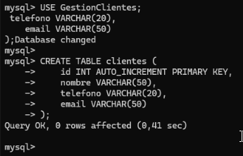

### 3. Poblado de Datos (Mock Data)
Antes de programar en Python, verificamos la estructura de la BD mediante una inserción manual de datos de prueba (sentencias DML). Esto nos permite tener registros visibles al conectar la aplicación por primera vez.

```SQL
-- Inserción de registros iniciales
INSERT INTO clientes (nombre, telefono, email)
VALUES
('Ana López', '600123123', 'ana@example.com'),
('Carlos Ruiz', '611222333', 'carlos@example.com');
```


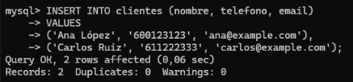

```SQL
-- Verificación de la integridad de los datos
SELECT * FROM clientes;
```

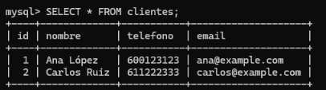

### 4. Gestión de Dependencias
Para vincular Python con MySQL, es necesario instalar un driver. Python no incluye esta funcionalidad en su biblioteca estándar, por lo que recurrimos a pip para instalar el conector oficial.

Comandos ejecutados en la VM Ubuntu:

```Bash
# Actualización e instalación de pip
sudo apt install python3-pip

# Instalación del driver oficial
pip3 install mysql-connector-python
```

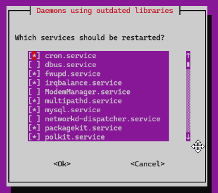


```Bash
# Verificación de la instalación: Ejecutamos un pequeño script en línea para confirmar que el módulo se carga correctamente:

python3 -c "import mysql.connector; print('OK - Librería cargada correctamente')"
```

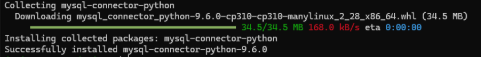


### 5. Organización del Espacio de Trabajo
Preparamos el entorno de desarrollo local creando un directorio específico para mantener el proyecto modular.

```Bash
mkdir ~/gestion_clientes
cd ~/gestion_clientes
```


```Bash
nano gestion_clientes.py
# El archivo gestion_clientes.py contendrá la lógica principal del programa, incluyendo el menú interactivo y el manejo de excepciones.
```

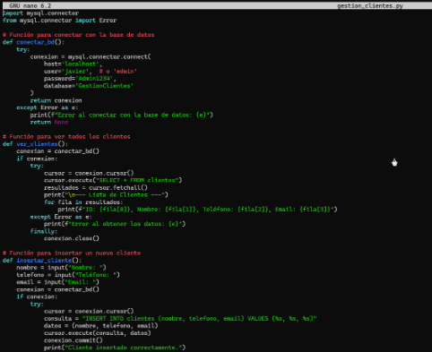


## ¿Cómo Ejecutar el Proyecto?
**Primero** tendremos que Clonar este repositorio:

```Bash
git clone https://github.com/usuario/repo.git

# Instalar dependencias:

pip3 install mysql-connector-python
# Ejecutar el script:

python3 gestion_clientes.py
```

## Comprobaciones

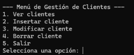

Conforme iniciemos nos encontraremos con el siguiente menú en nuestra consola (lo más bonito que se podía hacer mediante CLI)

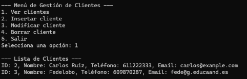

La primera opción es para ver a los clientes que tenemos creados en nuestra base de datos de MySQL.

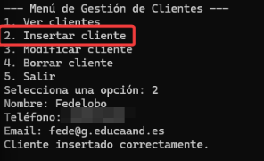

La segunda opción podemos ver como hemos insertado a nuestro usuario *FedeLobo* en nuestra base de datos y le hemos adjuntado el contenido que necesitabamos para la creación de un nuevo usuario en la base de datos.


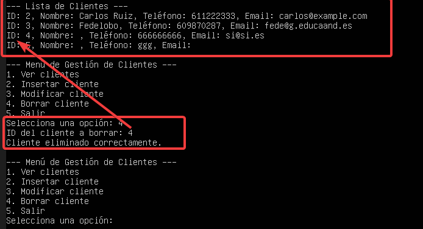

Y aquí podemos ver como funciona la ejecución de borrar un usuario de la base de datos. 


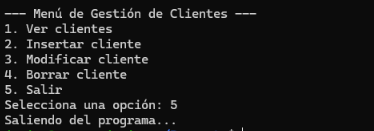

Por último podemos ver como nos podemos salir del programa sin ningún tipo de pega.

IES Celia Viñas - Proyecto de Programación 2025/2026
